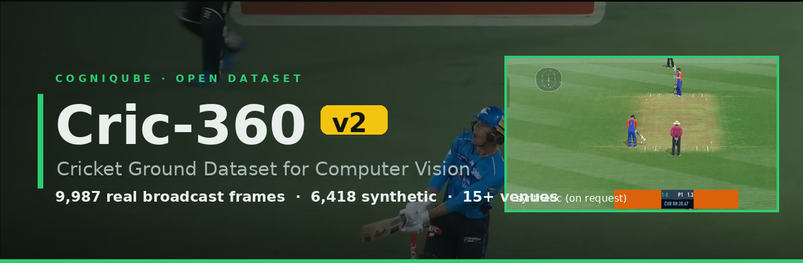
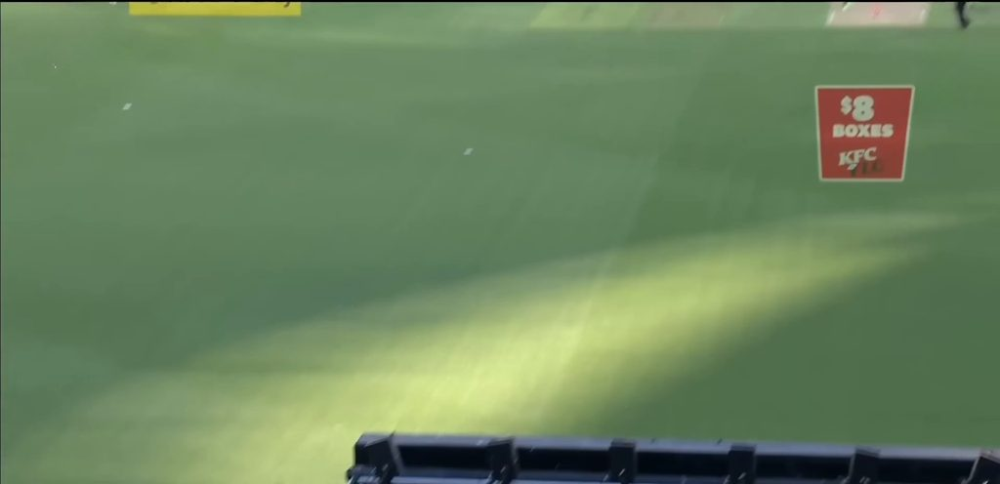
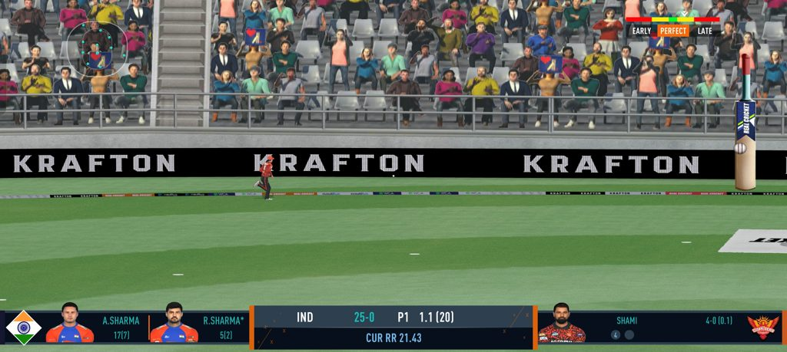

<div align="center">



# 🏏 Cric-360 — Cricket Ground Dataset

### The world's largest AI-curated cricket **ground** image dataset for computer vision

[](https://huggingface.co/datasets/sarimshahzad/Cric-360)
[](https://colab.research.google.com/github/Cogni-Qube/Cric360-Dataset/blob/main/notebooks/Cric360_v2_quickstart.ipynb)
[](LICENSE)
[](#-version-history)
[](#-whats-inside)
[](#-diversity)

**Maintained by [CogniQube](https://github.com/Cogni-Qube) · Lead: [Sarim Shahzad](https://github.com/sarimshahzad)**

[**Explore on 🤗**](https://huggingface.co/datasets/sarimshahzad/Cric-360) ·
[**Open in Colab ▶**](https://colab.research.google.com/github/Cogni-Qube/Cric360-Dataset/blob/main/notebooks/Cric360_v2_quickstart.ipynb) ·
[**Report an issue**](https://github.com/Cogni-Qube/Cric360-Dataset/issues)

</div>

---

Cric-360 is a large-scale cricket **ground image dataset** for computer-vision research —
ground/pitch segmentation, player & ball tracking, camera calibration, AR ad-insertion and scene
understanding. **v2 combines the original v1 frames with a 2.8× expansion** into one dataset.
This repository holds the **docs, metadata and a Colab notebook**; the images live on
**[🤗 Hugging Face](https://huggingface.co/datasets/sarimshahzad/Cric-360)**.

## 📖 Contents
- [What's inside](#-whats-inside)
- [Quick start](#-quick-start)
- [The two subsets](#-the-two-subsets)
- [Diversity](#-diversity)
- [Use cases](#-use-cases)
- [v1 segmentation masks](#-v1-ground-segmentation-masks)
- [Repository structure](#-repository-structure)
- [Licensing](#-licensing)
- [Version history](#-version-history)

## 📊 What's inside

| | **`grounds`** | **`games`** | **Total** |
|---|---:|---:|---:|
| **Images** | 13,545 | 6,418 | **19,963** |
| **Type** | Real TV broadcast | Synthetic (*Real Cricket* game) | mixed |
| **Availability** | ✅ Hosted on Hugging Face | 📩 On request | — |
| **Resolution** | 1280–1924 px wide | 2412 × 1080 | — |
| **License** | Apache 2.0 | Research-use only ⚠️ | see [Licensing](#-licensing) |

The **13,545 real frames** = **3,558 (v1)** + **9,987 (v2)**, combined into a single dataset and tagged
by a `version` column. **15+ venues worldwide · day / night / twilight · multiple broadcast angles.**

<table>
<tr>
<td width="50%"><br><sub><b>grounds</b> — real TV broadcast frame</sub></td>
<td width="50%"><br><sub><b>games</b> — synthetic <i>Real Cricket</i> frame (on request)</sub></td>
</tr>
</table>

## 🚀 Quick start

```python
from datasets import load_dataset

# ALL real broadcast frames (v1 + v2 = 13,545)
grounds = load_dataset("sarimshahzad/Cric-360", "grounds", split="train")

# filter by release or by the recommended split (metadata columns)
v2   = grounds.filter(lambda r: r["version"] == "v2")     # 9,987
test = grounds.filter(lambda r: r["split"]   == "test")   # 1,543
```

```bash
huggingface-cli download sarimshahzad/Cric-360 --repo-type dataset --local-dir Cric-360
```

▶️ Prefer the browser? **[Open the interactive quickstart in Google Colab](https://colab.research.google.com/github/Cogni-Qube/Cric360-Dataset/blob/main/notebooks/Cric360_v2_quickstart.ipynb)** — load data, view frames, plot stats, no install.

## 🖼️ The two subsets

### `grounds` — real broadcast frames (13,545) ✅

Genuine frames from live cricket TV broadcasts: **3,558 from v1 + 9,987 from v2**.

| Source (v2) | Competition | Region | Images |
|---|---|---|--:|
| `cognizant` | Sponsor-branded series | — | 2,424 |
| `bbl` | Big Bash League | Australia | 2,066 |
| `frame` | Unspecified | — | 1,449 |
| `test` | Test match | — | 1,090 |
| `irl vs ind` | Bilateral | Ireland v India | 826 |
| `psl` / `psll` | Pakistan Super League | Pakistan / UAE | 755 |
| `ipl` | Indian Premier League | India | 553 |
| `ban test` | Test match | Bangladesh | 408 |
| `sunrise` | Franchise T20 | — | 330 |
| others (`ind vs afg`, `ban`, `aus`) | International | — | 86 |

v1 frames carry `source_tag = v1_broadcast` plus `venue` / `has_carpet` labels where available.

### `games` — synthetic frames (6,418) — available on request ⚠️

Screenshots from the **Real Cricket** mobile game (**Nautilus Mobile / KRAFTON**) — CGI players,
crowds and stadiums at a fixed **2412 × 1080**. Great for augmentation and sim-to-real experiments.

**Not hosted publicly.** Shared **on demand for non-commercial research** — inspect
[`metadata/games_metadata.csv`](metadata/games_metadata.csv), then
[open an issue](https://github.com/Cogni-Qube/Cric360-Dataset/issues) to request the images.

> Copyrighted third-party game content, **excluded from Apache 2.0**. Rights remain with
> Nautilus Mobile / KRAFTON. Rights-holders may open an issue to request changes.

## 🌍 Diversity

| Dimension | Coverage |
|---|---|
| **Venues** | 15+ stadiums worldwide (Australia, India, Pakistan, UAE, Bangladesh, Ireland, …) |
| **Lighting** | Daylight · day–night twilight · full floodlit night · overcast |
| **Camera angles** | Wide broadcast, side-on, straight, high/overhead, low-angle, on-ground |
| **Ground state** | Fresh & worn pitch, footmarks, shadows, partial occlusion |
| **Formats** | T20 leagues, ODIs, Test matches, bilateral internationals |

## 🎯 Use cases

- Ground / pitch **segmentation** (v1 masks available — see below)
- Player & ball **detection / tracking**
- **Homography & camera calibration**
- **AR / virtual advertising** insertion
- **Depth** estimation & scene understanding
- **Sim-to-real / domain adaptation** (pair `grounds` with `games`)

## 🧩 v1 Ground-Segmentation masks

Pixel-level **ground-segmentation masks for the v1 frames are available** (playable-turf region) —
ideal for training/benchmarking segmentation models. Request them via
[Issues](https://github.com/Cogni-Qube/Cric360-Dataset/issues). Masks for the v2 frames are on the roadmap.

## 🗂️ Repository structure

```
Cric360-Dataset/
├── README.md
├── LICENSE                 ← Apache 2.0 (see Licensing for the synthetic-subset carve-out)
├── NOTICE                  ← third-party content / license scope
├── dataset_stats.json      ← combined statistics (v1 + v2)
├── metadata.csv            ← all 13,545 real frames (v1 + v2) — mirrors Hugging Face
├── notebooks/
│   └── Cric360_v2_quickstart.ipynb   ← Colab quickstart
├── metadata/
│   └── games_metadata.csv  ← on-request synthetic subset (6,418)
└── assets/
    └── banner.png, sample_grounds_broadcast.jpg, sample_games_synthetic.jpg
```

> Real `grounds` images (v1 + v2) live on **Hugging Face**. Synthetic `games` images are shared
> **on request** — this repo carries only their metadata so you can inspect them first.

## 📜 Licensing

| Part | License |
|---|---|
| `grounds` real frames (v1 + v2), metadata, code | **Apache 2.0** |
| `games` synthetic frames | **Research-use only** — © Nautilus Mobile / KRAFTON, not Apache 2.0 |

Underlying broadcast footage remains the property of the respective rights-holders; real frames are
shared under Apache 2.0 for research, consistent with v1.

## 🏷️ Version history

| Version | Date | Real frames | Synthetic | Highlights |
|---|---|--:|--:|---|
| **v2.0** | Jul 2026 | **13,545** (v1+v2) | 6,418 (on request) | Combined release, unified metadata, synthetic subset, Colab |
| v1.0 | Mar 2025 | 3,558 | — | First release · ground-segmentation masks available |

## 📖 Citation

```bibtex
@dataset{shahzad_cric360_v2_2026,
  author  = {Shahzad, Sarim and {CogniQube}},
  title   = {Cric-360 v2: A Cricket Broadcast and Synthetic Ground Dataset for Computer Vision},
  year    = {2026},
  version = {2.0},
  url     = {https://huggingface.co/datasets/sarimshahzad/Cric-360}
}
```

---

<div align="center">
Made with 🏏 by <a href="https://github.com/Cogni-Qube">CogniQube</a> ·
<a href="https://huggingface.co/datasets/sarimshahzad/Cric-360">Dataset on Hugging Face</a> ·
<a href="https://colab.research.google.com/github/Cogni-Qube/Cric360-Dataset/blob/main/notebooks/Cric360_v2_quickstart.ipynb">Colab</a>

⭐ If this dataset helps your research, consider starring the repo.
</div>
